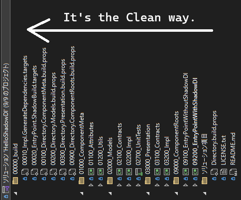
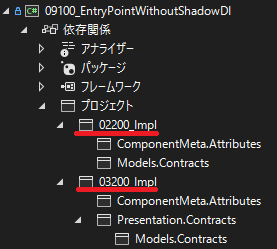
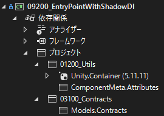

# Shadow DI Playground

This repository contains an early-stage prototype of a lightweight dependency injection mechanism, inspired by the idea of *Shadow DI*.  
The core concept is: **declare your contracts, drop your implementations, and let the magic happen—without physical references**.

> ⚠️ This is a work in progress. Expect sharp edges, missing docs, and some TODO comments whispering to the void.

## What’s This?

Shadow DI is a reflection-based, attribute-driven mechanism that:
- Automatically discovers and registers implementations from external assemblies
- Avoids static references between contract and implementation layers
- Embraces the spirit of Open/Closed Principle with minimal friction

## Status

Currently under development and **not production-ready**.  
If you’re curious, feel free to explore or contribute, but don’t expect stability (yet!).

## Usage Image

> 📝 The Japanese version of this article is available here:  
> 👉 [Qiita: Shadow DIでClean Architectureを影から支えられるかもしれん](https://qiita.com/cozyupk/items/92ed5fcc008ebcfd1284)

This library provides a lightweight way to simulate header files (C/C++) or SPI (Java) in .NET/C#.  
The main idea is: the entry point of the application **should only know the interfaces (contracts)**,  
and **not reference or know about the implementations at all** — not even via project references.


- [Left: Traditional DI Container usage (with project reference)](https://github.com/cozyupk/HelloShadowDI/blob/af987b2125c71dc4be08083cf2c1529c1fc31a47/ComponentRoots/EntryPointWithoutShadowDI/Program.cs)
- [Right: Shadow DI usage (no direct container registration or project references)](https://github.com/cozyupk/HelloShadowDI/blob/af987b2125c71dc4be08083cf2c1529c1fc31a47/ComponentRoots/EntryPointWithShadowDI/Program.cs)

Implementations are decorated with `[ShadowInjectable]` attributes like:

```csharp
[ShadowInjectable]
public class MessageModel : IMessageModel
```

And MSBuild `.targets` files help collect and register these automatically:

- [Injecting side (`*.Impl.csproj`)](https://github.com/cozyupk/HelloShadowDI/blob/af987b2125c71dc4be08083cf2c1529c1fc31a47/Models/Impl/02200_Impl.csproj#L13)
- [Receiving side (entry point .csproj)](https://github.com/cozyupk/HelloShadowDI/blob/af987b2125c71dc4be08083cf2c1529c1fc31a47/ComponentRoots/EntryPointWithShadowDI/09200_EntryPointWithShadowDI.csproj#L13)

The project folder names (e.g., `02200_`) represent the Clean Architecture layer ordering — just a personal hobby :)



## Output Comparison

### Without Shadow DI
The entry point directly references implementation projects:



This means: the entry project can **access all public members** of implementation modules, so the implementer must be very cautious about exposing things.

### With Shadow DI
The entry point **does not reference the implementation projects** at all:



This allows implementers to feel safe making certain members `public` — in other words, to create **Open extension points** (in the spirit of the Open-Closed Principle),  
since consumers cannot accidentally access or misuse them.

This structure may also contribute positively to code metrics in large-scale projects.

## Environment

- Verified with: Visual Studio 2022 (17.9.6)
- .NET SDK 8.0.204

## Dependencies

This project uses the following NuGet packages:

- [Unity.Container](https://www.nuget.org/packages/Unity.Container/) (MIT License)
- [xunit](https://www.nuget.org/packages/xunit/) (Apache License 2.0) — Used for unit tests

## Getting Started
Open `HelloShadowDI.sln` in Visual Studio.  
Run both `09100_EntryPointWithoutShadowDI` and `09200_EntryPointWithShadowDI` in Debug mode.  
If you see "Hello world!" in the debug output window for each, the setup was successful.

## TODO / Roadmap

- [ ] Attribute on interfaces: e.g., "this interface must have a ShadowInjectable implementation"
- [ ] Scoped registration support (lifetime management / child containers)
- [ ] Diagnostic logging support
- [ ] Prioritized ShadowInjectable registration
- [ ] Official documentation

## License

MIT License.  
Use it, break it, fork it, improve it—just don’t sue me if your app explodes.

---

*This project may eventually grow into a more robust framework, or it may just be an experiment that lives happily in the shadows.* ☁️
